# Sơ đồ UML — Hệ thống quản lý công việc công trình

Mỗi khối bên dưới có thể dán trực tiếp vào [Mermaid Live Editor](https://mermaid.live/) hoặc Markdown hỗ trợ Mermaid. Các sơ đồ Use Case và Deployment được biểu diễn bằng `flowchart` vì Mermaid chưa hỗ trợ cú pháp UML `usecaseDiagram` gốc.

## 1. Use Case

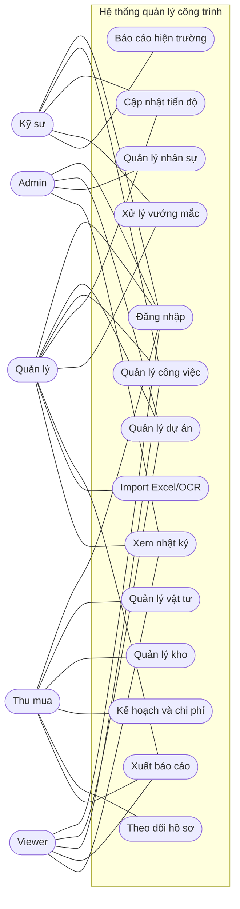

## 2. Sequence diagrams

### 2.1 Khởi tạo dự án và import Excel

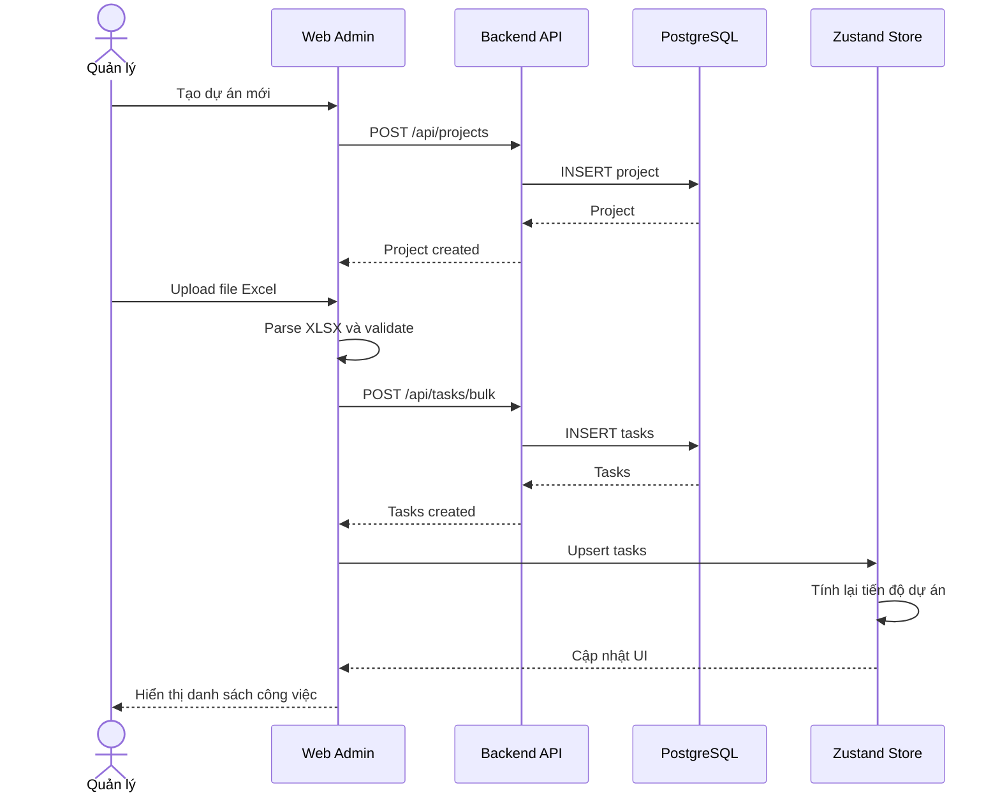

### 2.2 Cập nhật tiến độ thi công

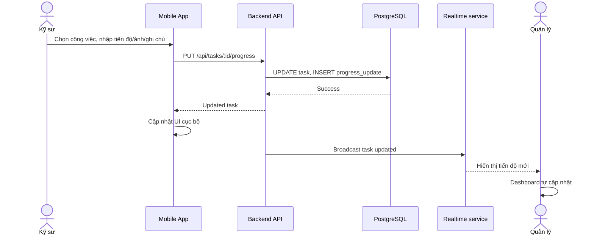

### 2.3 Xử lý vướng mắc

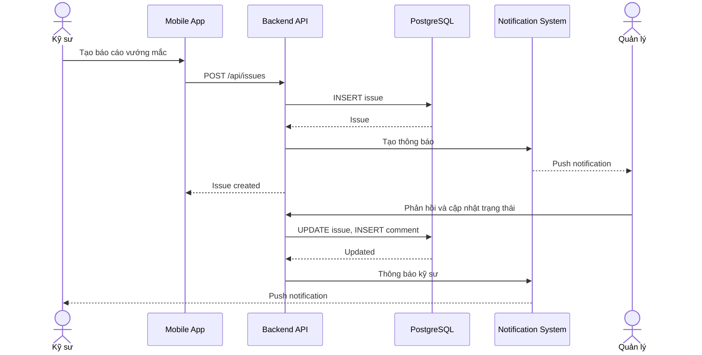

### 2.4 Quản lý vật tư và nhập kho

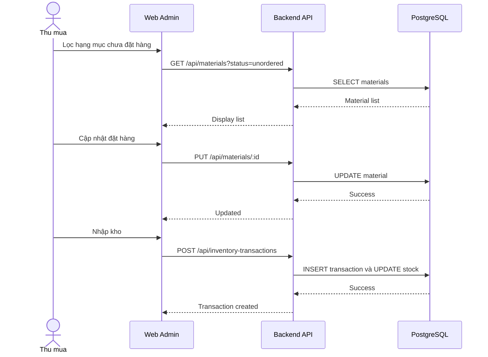

## 3. Activity diagrams

### 3.1 Khởi tạo dự án

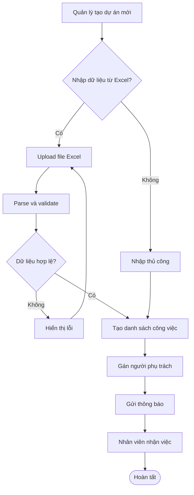

### 3.2 Cập nhật tiến độ

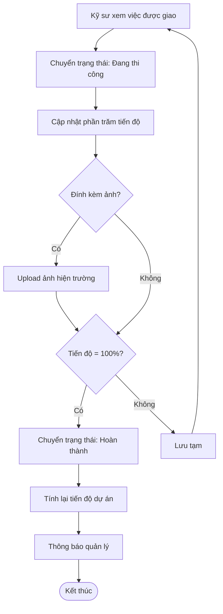

### 3.3 Xử lý vướng mắc

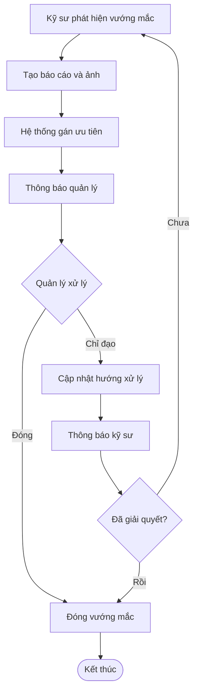

## 4. Class diagram

```mermaid
classDiagram
    class User { +UUID id +String code +String fullName +String email +UserRole role +AccountStatus status +login() +updateProfile() }
    class Project { +UUID id +String code +String name +ProjectStatus status +Decimal progressPercent +Date startDate +Date endDate +calculateProgress() }
    class Task { +UUID id +UUID projectId +UUID parentId +String code +String name +Decimal progress +TaskStatus status +TaskPriority priority +updateProgress() +assignEngineer() }
    class ProgressUpdate { +UUID id +UUID taskId +UUID engineerId +Decimal progress +String note +DateTime recordedAt }
    class Material { +UUID id +UUID projectId +UUID taskId +String code +String name +Decimal currentStock +Decimal unitPrice +updateStock() }
    class InventoryTransaction { +UUID id +UUID materialId +UUID projectId +TransactionType type +Decimal quantity +DateTime transactionDate }
    class Issue { +UUID id +UUID projectId +UUID taskId +String title +IssueStatus status +IssuePriority priority +updateStatus() +addComment() }
    class FieldLog { +UUID id +UUID projectId +UUID taskId +UUID engineerId +String note +String[] images +DateTime timestamp }
    class ProjectMaterialPlan { +UUID id +UUID projectId +String jobContent +Decimal contractVolume +String orderedStatus }
    class ProjectPurchasing { +UUID id +UUID projectId +String content +Decimal totalAmount +String paymentStatus +calculateTotal() }
    class ProjectExpense { +UUID id +UUID projectId +Date date +String content +Decimal totalAmount }
    class LaborPayroll { +UUID id +UUID projectId +String workerName +Decimal totalAmount +String paymentStatus }
    class DocumentTrack { +UUID id +UUID projectId +String contractNo +String company +String paymentStatus +Boolean isCompleted }
    class ActivityLog { +UUID id +UUID userId +UUID projectId +String action +DateTime timestamp }

    User "1" --> "*" Project : manages
    User "1" --> "*" Task : assignedTo
    User "1" --> "*" FieldLog : creates
    User "1" --> "*" ActivityLog : performs
    Project "1" *-- "*" Task : contains
    Project "1" *-- "*" Material : has
    Project "1" *-- "*" Issue : has
    Project "1" *-- "*" FieldLog : has
    Project "1" *-- "*" ProjectMaterialPlan
    Project "1" *-- "*" ProjectPurchasing
    Project "1" *-- "*" ProjectExpense
    Project "1" *-- "*" LaborPayroll
    Project "1" *-- "*" DocumentTrack
    Task "0..1" --> "*" Task : parent
    Task "1" --> "*" ProgressUpdate
    Task "1" --> "*" Material : requires
    Task "1" --> "*" Issue : relatesTo
    Material "1" --> "*" InventoryTransaction
```

## 5. Deployment diagram

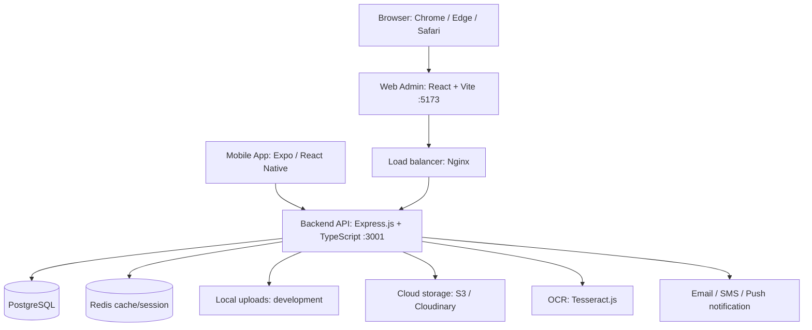

## 6. ERD

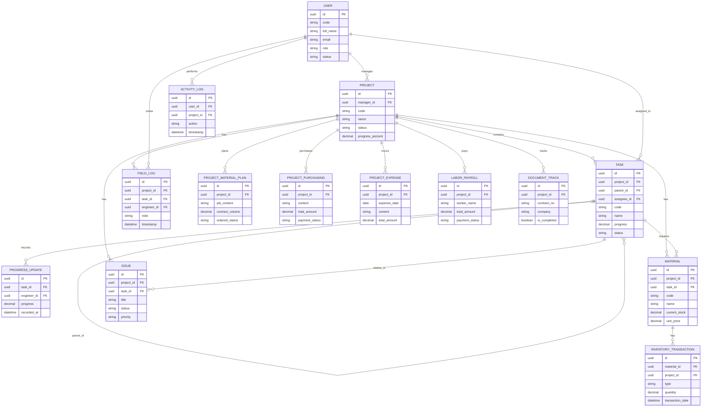

## 7. State diagram — Task

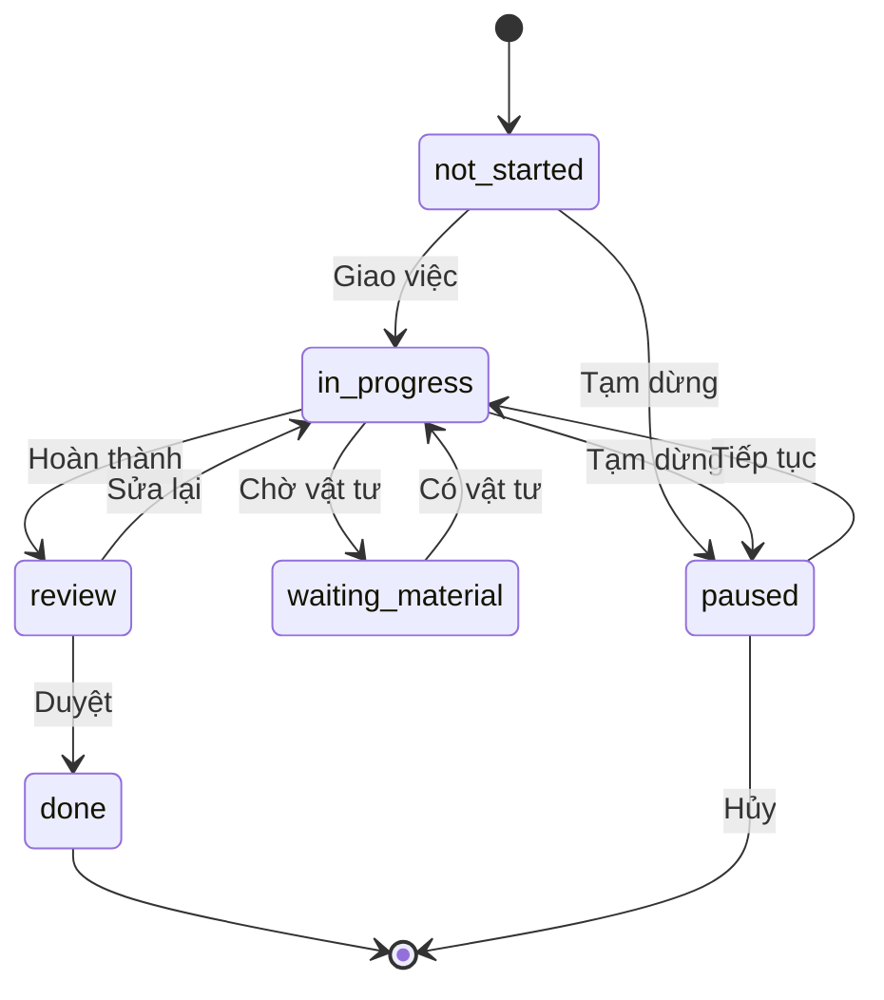

## 8. State diagram — Issue

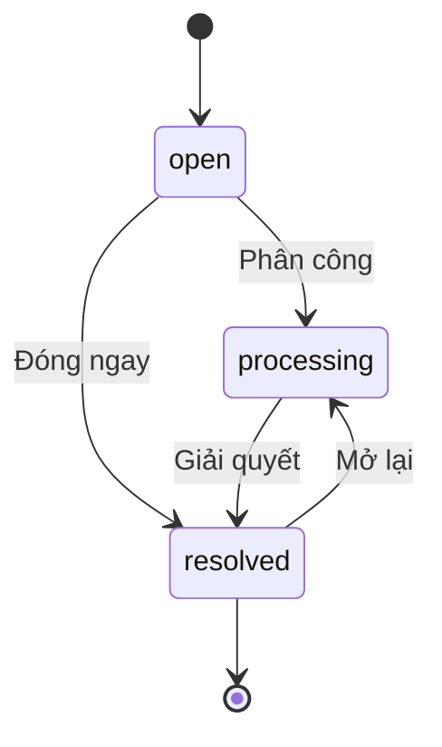

## Cách xem và xuất ảnh

1. Mở file Markdown này trong VS Code (có extension Mermaid) hoặc dán từng khối vào Mermaid Live Editor.
2. Trong Mermaid Live Editor, dùng **Actions → PNG** hoặc **SVG** để xuất từng sơ đồ.
3. SVG phù hợp nhất cho tài liệu/slide vì phóng to không vỡ hình.
